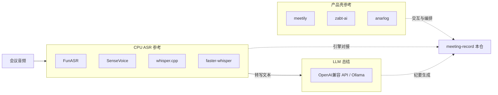

# 参考项目总览

> 源码：`repos/` · 更新：2026-07-19  
> **本仓锁定方案：** 单人 · 无 GPU · **CPU ASR** + **LLM 总结** — [research 决策](../research/2026-07-19-stack-decision-cpu-llm.md)

## 矩阵

| 项目 | 一句话 | 技术栈 | 分层 | 优先级 | 本地路径 |
|---|---|---|---|---|---|
| **meetily** | 本地优先会议助手（转写+总结） | Rust/Tauri + TS · Whisper/Parakeet · Ollama/API | 产品 | ★★★★★ | `repos/meetily` |
| **FunASR** | 工业级 ASR 工具箱（中文强、CPU 可行） | Python · SenseVoice/Paraformer 等 | ASR | ★★★★★ | `repos/FunASR` |
| **SenseVoice** | 多语 ASR + 情感/事件；有 CPU/GGUF 路径 | Python / llama.cpp GGUF | ASR | ★★★★★ | `repos/SenseVoice` |
| **whisper.cpp** | Whisper 的 C++ CPU/GPU 运行时 | C/C++ | ASR | ★★★★ | `repos/whisper.cpp` |
| **faster-whisper** | CTranslate2 加速的 Whisper | Python | ASR | ★★★★ | `repos/faster-whisper` |
| **zabt-ai** | 自托管 Web：上传→队列→转写→LLM | FastAPI + Next · Celery · faster-whisper | 产品·服务 | ★★★★ | `repos/zabt-ai` |
| **anarlog** | 极简本地会议笔记 + BYO LLM | 本地 md | 产品·极简 | ★★★ | `repos/anarlog` |
| **awesome-design-md** | 各品牌 DESIGN.md 样本集 | Markdown | UI | ★★★ | `repos/awesome-design-md` |

> Star 数量会变；克隆时以 GitHub 页面为准。选型依据是 **与「CPU + LLM」贴合度**，不是 star  alone。

## 分层索引

| 层 | 摘要文档 | repos |
|---|---|---|
| 产品壳 | [product.md](product.md) | meetily, zabt-ai, anarlog |
| 转写引擎 | [asr.md](asr.md) | FunASR, SenseVoice, whisper.cpp, faster-whisper |
| UI 气质 | [ui.md](ui.md) · 真源 [`../DESIGN.md`](../DESIGN.md) | awesome-design-md（已选 claude） |

## 与本仓方案的关系

| 本仓模块（规划） | 优先读 |
|---|---|
| 上传/列表/纪要编辑 UX | meetily · anarlog · **本仓 `docs/design/DESIGN.md`** |
| 服务端任务队列 | zabt-ai（注意其默认 diarization/GPU 假设，我们 CPU 裁剪） |
| **默认 ASR** | **FunASR + SenseVoice** |
| ASR 备选 | whisper.cpp · faster-whisper small/int8 |
| 总结 | meetily 的 Ollama/API 插件思路 · zabt 的 LLM 调用 |

## 明确不作为默认引擎

| 曾考虑 | 原因 |
|---|---|
| MOSS-Transcribe-Diarize | 无 GPU 不适合当前服务器；若以后有卡可再引入 |
| WhisperX + pyannote 全开 | 显存/复杂度高；说话人非单人 CPU 方案 P0 |

## 对比维度（实现时用）

| 维度 | meetily | zabt-ai | FunASR/SenseVoice | whisper 系 |
|---|---|---|---|---|
| 形态 | 桌面 local-first | Web 自托管 | 库/工具箱 | 库/运行时 |
| 默认算力 | 本机 CPU/GPU | 偏 GPU，有 CPU compose | **CPU 中文友好** | CPU 可行、中文弱于 SenseVoice 档 |
| 总结 | Ollama/API | OpenAI 兼容 | 无（只 ASR） | 无 |
| 数据落点 | 本机 | Postgres/对象存储 | 调用方自定 | 调用方自定 |
